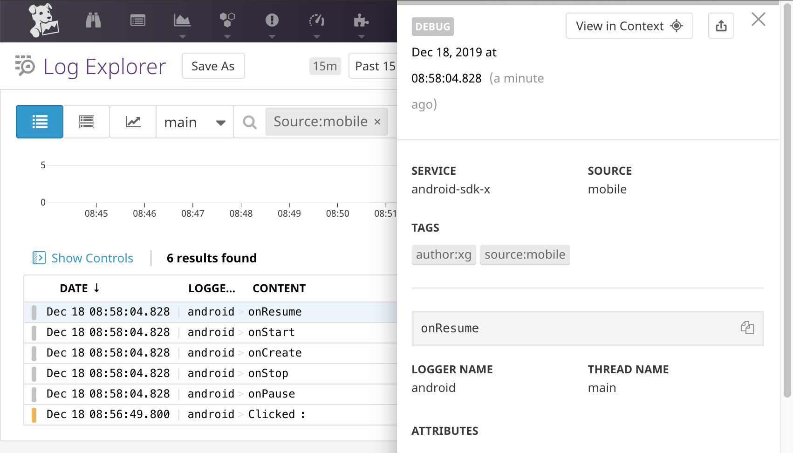

# Datadog SDK for Android

> A client-side Android library to interact with Datadog.

## Getting Started

### Log Collection

See the dedicated [Datadog Android Log Collection documentation](http://docs.datadoghq.com/logs/log_collection/android) to learn how to forward logs from your Android application to Datadog.

### Real User Monitoring

See the dedicated [Datadog Android RUM Collection documentation](https://docs.datadoghq.com/real_user_monitoring/android/) to learn how to send RUM data from your Android application to Datadog.

## Log Integrations

### Timber

If your existing codebase is using Timber, you can forward all those logs to  Datadog automatically by using the [dedicated library](timber_integration.md).

## RUM Integrations

### Coil

If you use Coil to load images in your application, take a look at Datadog's [dedicated library](dd-sdk-android-coil/README.md).

### Fresco

If you use Fresco to load images in your application, take a look at Datadog's [dedicated library](dd-sdk-android-fresco/README.md).

### Glide

If you use Glide to load images in your application, take a look at our [dedicated library](dd-sdk-android-glide/README.md).

### Picasso

If you use Picasso, let it use your `OkHttpClient`, and you'll get RUM and APM information about network requests made by Picasso.

```kotlin
        val picasso = Picasso.Builder(context)
                .downloader(OkHttp3Downloader(okHttpClient))
                // …
                .build()
        Picasso.setSingletonInstance(picasso)
```

### Retrofit

If you use Retrofit, let it use your `OkHttpClient`, and you'll get RUM and APM information about network requests made with Retrofit.

```kotlin
        val retrofitClient = Retrofit.Builder()
                .client(okHttpClient)
                // …
                .build()
```

## Looking up your logs

When you open your console in Datadog, navigate to the Logs section. In the search bar, type `source:android`. This filters your logs to only show the ones coming from mobile applications (Android and iOS).



## Looking up your logs

When you open your console in Datadog, navigate to the Logs section. In the search bar, type `source:android`. This filters your logs to only show the ones coming from mobile applications (Android and iOS).


## Troubleshooting

If you encounter any issue when using the Datadog SDK for Android, please take a look at 
the [troubleshooting checklist](docs/TROUBLESHOOTING.md), or at 
the existing [issues](https://github.com/DataDog/dd-sdk-android/issues?q=is%3Aissue).

## Warning

We have not tested the SDK on Roku devices running with Android OS and we cannot guarantee that it will perform well.
If you encounter any problems while using our SDK for these particular devices please contact us at [Datadog Support](https://docs.datadoghq.com/help/)
or you can directly open an issue in our GitHub project.

## Contributing

Pull requests are welcome. First, open an issue to discuss what you would like to change. For more information, read the [Contributing Guide](CONTRIBUTING.md).

## License

[Apache License, v2.0](LICENSE)
