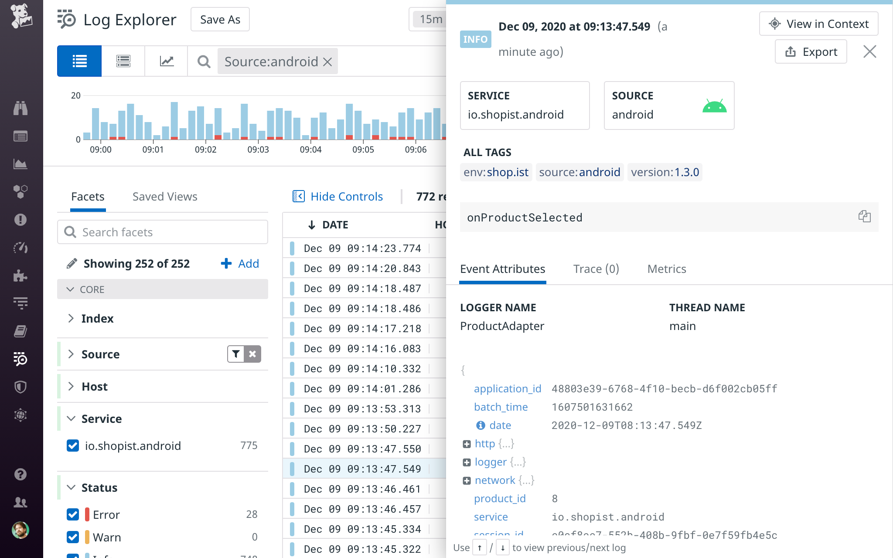
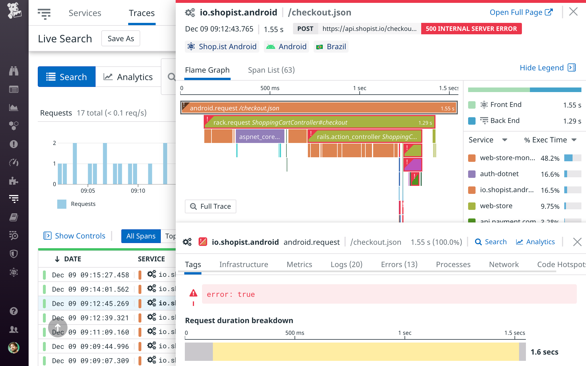
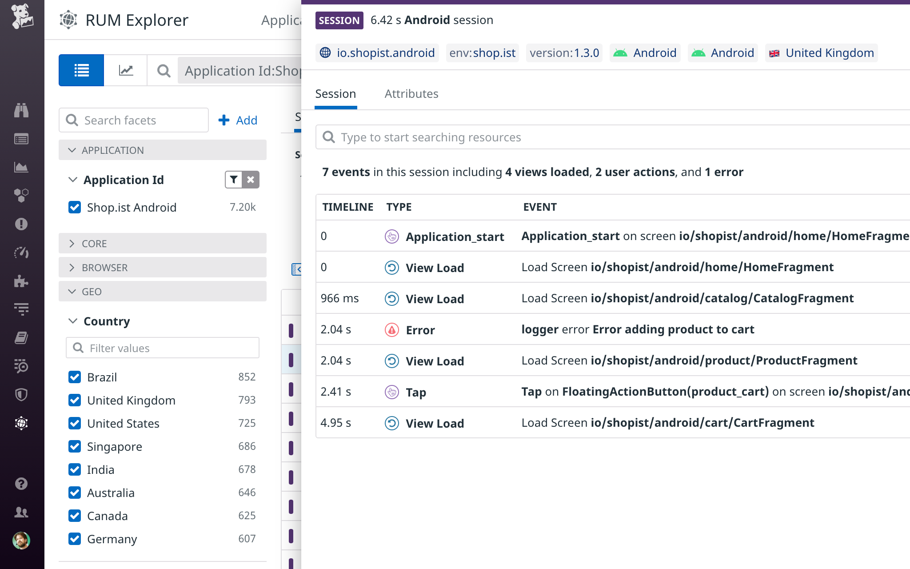

# Datadog SDK for Android and Android TV

> A client-side Android and Android TV library to interact with Datadog.

## Getting Started

### Log Collection

See the dedicated [Datadog Android Log Collection documentation][1] to learn how to forward logs from your Android or Android TV application to Datadog.

### Real User Monitoring

See the dedicated [Datadog Android RUM Collection documentation][2] to learn how to send RUM data from your Android or Android TV application to Datadog.

## Log Integrations

### Timber

If your existing codebase is using Timber, you can forward all those logs to  Datadog automatically by using the [dedicated library](integrations/dd-sdk-android-timber/README.md).

## RUM Integrations

### Coil

If you use Coil to load images in your application, see Datadog's [dedicated library](integrations/dd-sdk-android-coil/README.md).

### Fresco

If you use Fresco to load images in your application, see Datadog's [dedicated library](integrations/dd-sdk-android-fresco/README.md).

### Glide

If you use Glide to load images in your application, see Datadog's [dedicated library](integrations/dd-sdk-android-glide/README.md).

### Jetpack Compose

If you use Jetpack Compose in your application, see Datadog's [dedicated library](integrations/dd-sdk-android-compose/README.md).

### SQLDelight

If you use SQLDelight in your application, see Datadog's [dedicated library](integrations/dd-sdk-android-sqldelight/README.md).

### RxJava

If you use RxJava in your application, see Datadog's [dedicated library](integrations/dd-sdk-android-rx/README.md).

### Picasso

If you use Picasso, use it with the `OkHttpClient` that's been instrumented with the Datadog SDK for RUM and APM information about network requests made by Picasso.

```kotlin
        val picasso = Picasso.Builder(context)
                .downloader(OkHttp3Downloader(okHttpClient))
                // …
                .build()
        Picasso.setSingletonInstance(picasso)
```

### Retrofit

If you use Retrofit, use it with the `OkHttpClient` that's been instrumented with the Datadog SDK for RUM and APM information about network requests made with Retrofit.

```kotlin
        val retrofitClient = Retrofit.Builder()
                .client(okHttpClient)
                // …
                .build()
```

### Apollo (GraphQL)

If you use Apollo, use it with the `OkHttpClient` that's been instrumented with the Datadog SDK for RUM and APM information about all the queries performed through Apollo client.

```kotlin
        val apolloClient =  ApolloClient.builder()
                 .okHttpClient(okHttpClient)
                 .serverUrl(<APOLLO_SERVER_URL>)
                 .build()
```

### Kotlin Coroutines

If you use Kotlin Coroutines, see Datadog's [dedicated library with extensions for RUM](integrations/dd-sdk-android-rum-coroutines/README.md) and with [extensions for Trace](integrations/dd-sdk-android-trace-coroutines/README.md)

## Looking up your logs

When you open your console in Datadog, navigate to the [Log Explorer][3]. In the search bar, type `source:android`. This filters your logs to only show the ones coming from Android or Android TV applications.



## Looking up your spans

When you open your console in Datadog, navigate to [**APM** > **Services**][4]. In the list of services, you can see all your Android and Android TV applications (by default, the service name matches your application's package name, for example: `com.example.android`). You can access all the traces started from your application.



## Looking up your RUM events

When you open your console in Datadog, navigate to the [RUM Explorer][5]. In the side bar, you can select your application and explore Sessions, Views, Actions, Errors, Resources, and Long Tasks.



## Troubleshooting

If you encounter any issue when using the Datadog SDK for Android and Android TV, please take a look at 
the [troubleshooting checklist][6], [common problems](docs/advanced_troubleshooting.md), or at
the existing [issues](https://github.com/DataDog/dd-sdk-android/issues?q=is%3Aissue).

<div class="alert alert-warning">
Datadog cannot guarantee the Android and Android TV SDK's performance on Roku devices running with Android OS. If you encounter any issues when using the SDK for these devices, contact <a href="https://docs.datadoghq.com/help/">Datadog Support</a> or open an issue in our GitHub project.
</div>

## Contributing

Pull requests are welcome. First, open an issue to discuss what you would like to change. For more information, read the [Contributing Guide](CONTRIBUTING.md).

## License

[Apache License, v2.0](LICENSE)

[1]: https://docs.datadoghq.com/logs/log_collection/android/?tab=kotlin
[2]: https://docs.datadoghq.com/real_user_monitoring/android/?tab=kotlin
[3]: https://app.datadoghq.com/logs
[4]: https://app.datadoghq.com/apm/services
[5]: https://app.datadoghq.com/rum/explorer
[6]: https://docs.datadoghq.com/real_user_monitoring/android/troubleshooting/