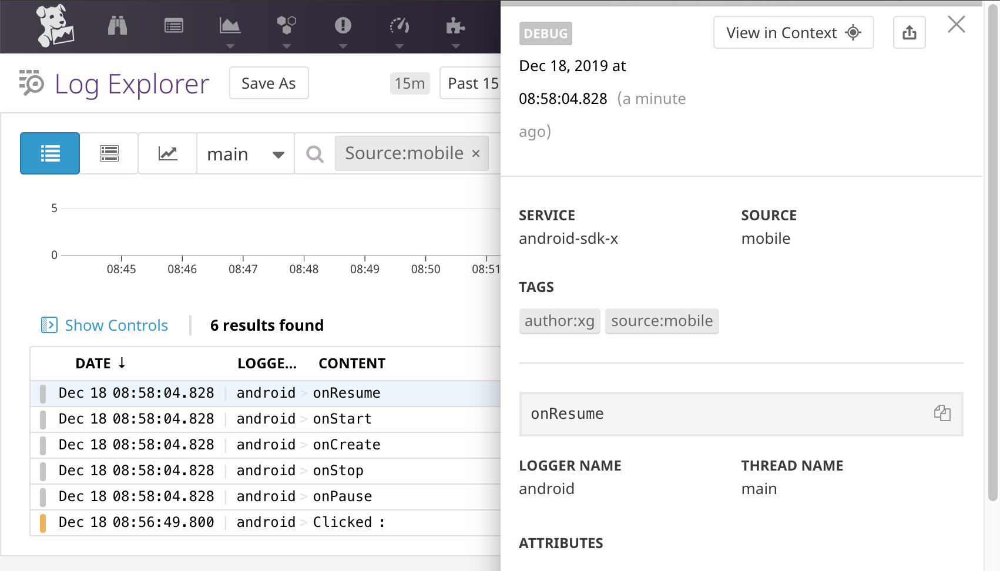

# Datadog SDK for Android

> A client-side Android library to interact with Datadog.

## Getting Started 

### Gradle Dependency

To include the Datadog SDK for Android in your project, simply add the following
to your application's `build.gradle` file.

```
repositories {
    maven { url "https://dl.bintray.com/datadog/datadog-maven" }
}

dependencies {
    implementation "com.datadoghq:dd-sdk-android:<latest-version>"
}
```

### Migrating from earlier versions

If you were a user of the SDK version `0.2.5` or lower, take a look at our 
[Migration Guide](Migrating_To_1.0.0.md).

### Initial Setup

Before you can use the SDK, you need to setup the library with your application
context and your API token. You can create a token from the Integrations > API
in Datadog. **Make sure you create a key of type `Client Token`.**

```kotlin
class SampleApplication : Application() {

    override fun onCreate() {
        super.onCreate()
        Datadog.initialize(this, BuildConfig.DD_CLIENT_TOKEN)
    }
}
```

You can create a `Logger` instance using the dedicated builder, as follow:

```kotlin
    logger = Logger.Builder().build();
```

You can then send logs with the following methods, mimicking the ones available
in the Android Framework: 

```kotlin
    logger.d("A debug message.")
    logger.i("Some relevant information ?")
    logger.w("An important warning…")
    logger.e("An error was met!")
    logger.wtf("What a Terrible Failure!")
```

For more information on the SDK capabilities, you can read a more complete [Documentation](dd-sdk-android/README.md).


### Integrating with Timber

If you're existing codebase is already using Timber, you can migrate to Datadog 
easily by using our [dedicated library](dd-sdk-android-timber/README.md).

## Looking up your logs

When you open your console in Datadog, navigate to the Logs section, and in the search bar, type 
`source:mobile`. This will filter your logs to only show the ones coming from mobile applications 
(Android and iOS).



## Contributing

Pull requests are welcome, but please open an issue first to discuss what you
would like to change. For more information, read the 
[Contributing Guide](CONTRIBUTING.md).

## License

[Apache License, v2.0](LICENSE)
