# Datadog Android SDK Core Architecture

## Overview

The `core` module serves as the foundation for the Datadog Android SDK, providing essential functionality for initialization, configuration, and core services that other modules depend on.

## Architecture Diagrams

### Component Relationships

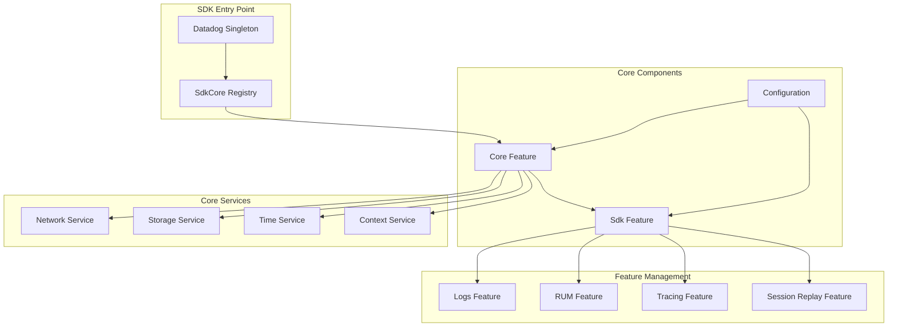

### Initialization Flow

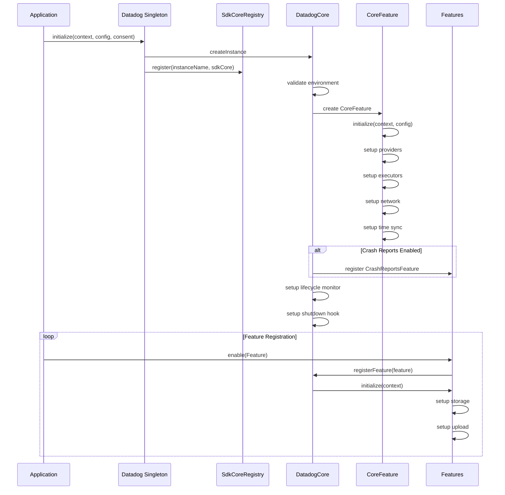

### Initialization Process Details

The initialization process of the Datadog Android SDK follows these key steps:

1. **SDK Entry Point**
   - The application calls `Datadog.initialize()` with context, configuration, and tracking consent
   - The SDK validates the environment name and configuration
   - A unique instance ID is generated based on the instance name and site configuration

2. **Core Initialization**
   - `DatadogCore` is created with the application context and instance ID
   - depending on how many SDK instances are created there is going to be a different `DatadogCore` instance for each one
   - `CoreFeature` is initialized first, as it provides essential services for other features
   - Core services are set up:
     - Context providers
     - Network monitoring
     - System information
     - Time synchronization
     - User tracking consent
     - Account information

3. **Feature Registration**
   - Features are registered through their respective entry points (e.g., `Logs.enable()`, `Rum.enable()`)
   - Each feature is wrapped in an `SdkFeature` instance
   - Features are initialized with:
     - Storage configuration
     - Upload configuration
     - Event mappers
     - Custom endpoints (if specified)

4. **Lifecycle Management**
   - Process lifecycle monitoring is set up
   - Shutdown hooks are registered
   - Feature-specific lifecycle handlers are initialized

5. **Configuration Validation**
   - Environment name validation
   - Client token validation
   - Feature-specific configuration validation
   - Developer mode settings (if enabled)

6. **Storage and Upload Setup**
   - Each feature sets up its storage system
   - Upload schedulers are configured
   - Batch processing is initialized
   - Encryption is set up (if configured)

7. **Feature Dependencies**
   - Features can depend on core services
   - Cross-feature communication is established
   - Feature-specific context providers are initialized

### Context Management

#### Core Context Structure

```mermaid
graph TB
    subgraph "DatadogContext"
        CoreInfo[Core Information]
        TimeInfo[Time Information]
        ProcessInfo[Process Information]
        NetworkInfo[Network Information]
        DeviceInfo[Device Information]
        UserInfo[User Information]
        AccountInfo[Account Information]
        FeaturesContext[Features Context Map]
    end

    subgraph "Core Information"
        Site[Site]
        ClientToken[Client Token]
        Service[Service Name]
        Env[Environment]
        Version[Version]
        Variant[Variant]
        Source[Source]
        SdkVersion[SDK Version]
    end

    subgraph "Time Information"
        DeviceTime[Device Time]
        ServerTime[Server Time]
        TimeOffset[Time Offset]
    end

    subgraph "Features Context"
        LogsContext[Logs Context]
        RumContext[RUM Context]
        TraceContext[Trace Context]
        ReplayContext[Replay Context]
    end

    CoreInfo --> Site
    CoreInfo --> ClientToken
    CoreInfo --> Service
    CoreInfo --> Env
    CoreInfo --> Version
    CoreInfo --> Variant
    CoreInfo --> Source
    CoreInfo --> SdkVersion

    TimeInfo --> DeviceTime
    TimeInfo --> ServerTime
    TimeInfo --> TimeOffset

    FeaturesContext --> LogsContext
    FeaturesContext --> RumContext
    FeaturesContext --> TraceContext
    FeaturesContext --> ReplayContext
```

#### Feature Context Management

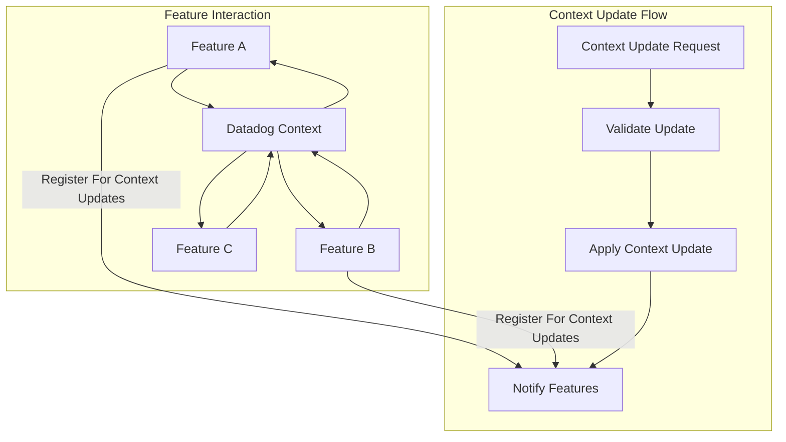

#### Context Access Flow

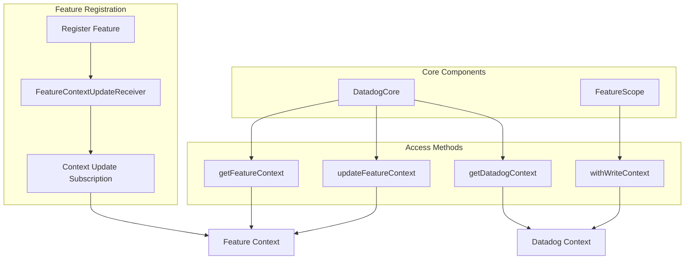

### Context Management Details

The DatadogContext system provides a centralized way to manage and share context information across all SDK features. Here's how it works:

1. **Core Context Structure**
   - **Core Information**: Basic SDK configuration (site, token, service, etc.)
   - **Time Information**: Device and server time synchronization
   - **Process Information**: Current process state
   - **Network Information**: Network connectivity and quality
   - **Device Information**: Device characteristics and capabilities
   - **User Information**: User identification and properties
   - **Account Information**: Account details and metadata
   - **Features Context**: Feature-specific context data

2. **Feature Context Management**
   - **Registration**: Features register with the SDK and get access to context
   - **Initialization**: Features initialize their context during setup
   - **Updates**: Features can update their context through synchronized operations
   - **Synchronization**: Context updates are propagated to all interested features
   - **Shared Context**: Features can access and modify shared context data

3. **Context Access Flow**
   - **Direct Access**: `DatadogCore.getDatadogContext()` for full context access
   - **Feature Access**: `DatadogCore.getFeatureContext()` for feature-specific data
   - **Context Updates**: `DatadogCore.updateFeatureContext()` for synchronized updates
   - **Write Operations**: `FeatureScope.withWriteContext()` for thread-safe event creation
   - **Cross-Feature**: Features can access and react to other features' context

4. **Thread Safety**
   - Context is immutable at the top level
   - Feature context updates are synchronized
   - Write operations are thread-safe
   - Cross-feature updates are atomic

The context system ensures that all events have consistent and up-to-date information about the application state, user, device, and other relevant context.

### Inter-Feature Communication

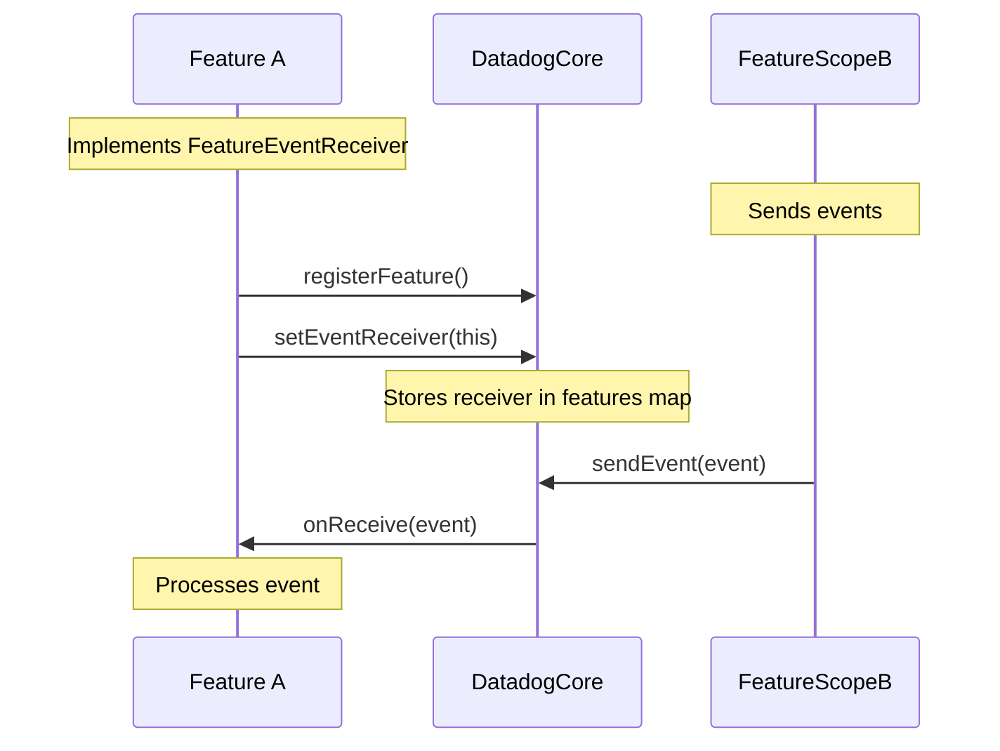

### Inter-Feature Communication Details

The SDK provides a robust mechanism for features to communicate with each other through a centralized event system managed by `DatadogCore`. Here's how it works:

1. **Feature Registration and Setup**
   - Features are registered with `DatadogCore` using `registerFeature()`
   - Each feature is wrapped in an `SdkFeature` instance which implements `FeatureScope` interface and provides implementation for `sendEvent` method
   ```kotlin
    sdkCore.getFeature("rum").sendEvent(event)
   ```
   - During initialization, features can register as event receivers
   - Example from `RumFeature`:
     ```kotlin
     override fun onInitialize(appContext: Context) {
         // ... other initialization ...
         sdkCore.setEventReceiver(name, this)
         initialized.set(true)
     }
     ```

2. **Event Receiver Management**
   - `DatadogCore` maintains a thread-safe map of features
   - Receivers are stored in an `AtomicReference` for thread safety
   - Features can unregister using `removeEventReceiver()`
   - Example from `DatadogCore`:
     ```kotlin
     override fun setEventReceiver(featureName: String, receiver: FeatureEventReceiver) {
         val feature = features[featureName]
         if (feature == null) {
             internalLogger.log(Level.WARN, Target.USER) { 
                 "Feature $featureName not registered" 
             }
         } else {
             feature.eventReceiver.set(receiver)
         }
     }
     ```

3. **Event Sending and Processing**
   - Features send events through their `FeatureScope`
   - Events are sent synchronously on the calling thread
   - Events can be of any type (Any)
   - Receivers implement `FeatureEventReceiver` interface
   - Example from `RumFeature`:
     ```kotlin
     override fun onReceive(event: Any) {
         when (event) {
             is JvmCrash -> handleCrash(event)
             is Map<*, *> -> handleMapEvent(event)
             else -> logUnsupportedEvent(event)
         }
     }
     ```

4. **Thread Safety and Error Handling**
   - Event registration is thread-safe using `ConcurrentHashMap`
   - Event delivery is synchronous and thread-safe
   - Receivers must handle events on any thread

The inter-feature communication system enables:
- Cross-feature event handling (e.g., RUM handling crash events)
- Feature coordination and state sharing
- Centralized event processing
- Thread-safe event delivery

### Data Flow

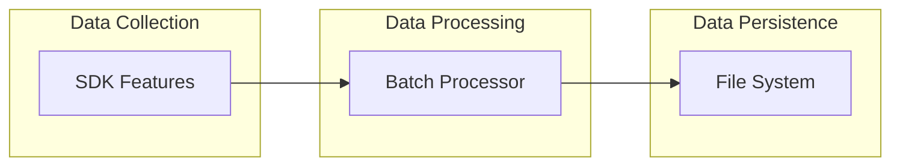

### Data Processing Details

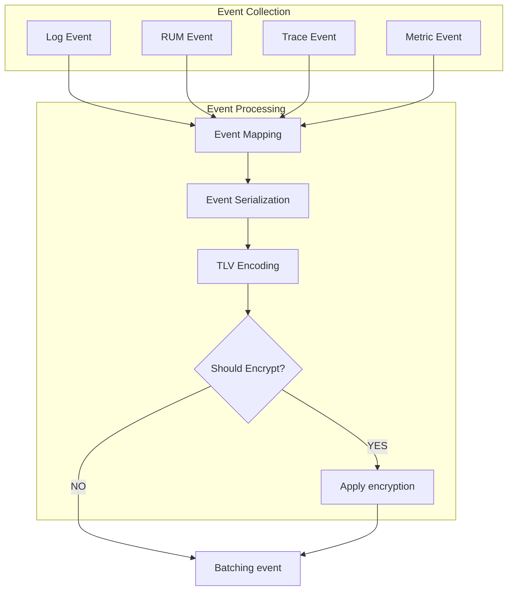

### Event Batching Process

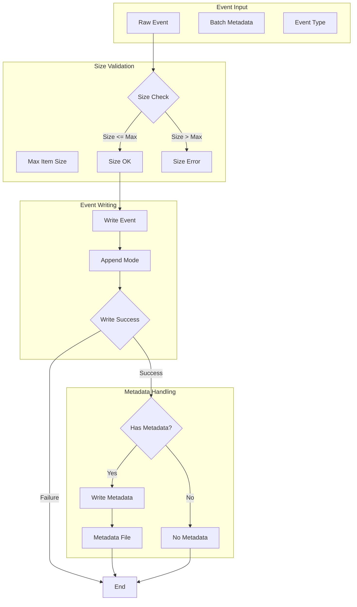

### Event Batching Details

The event batching process follows these steps:

1. **Event Input**
   - Raw event data
   - Optional batch metadata
   - Event type information

2. **Size Validation**
   - Checks if event size is within configured limits
   - Maximum item size is defined in `FilePersistenceConfig`
   - Events exceeding the limit are rejected

3. **Event Writing**
   - Events are written to the batch file in append mode
   - Each event is written sequentially
   - Write success is tracked for each operation

4. **Metadata Handling**
   - If batch metadata is provided and metadata file exists:
     - Metadata is written to a separate file
     - Metadata file is overwritten (not appended)
   - If no metadata or metadata file:
     - Process completes without metadata writing

5. **Error Handling**
   - Size validation errors are logged
   - Write failures are logged
   - Metadata write failures are logged as warnings

The batching process ensures efficient storage of events while maintaining data integrity and proper error handling.

### TLV Format Details

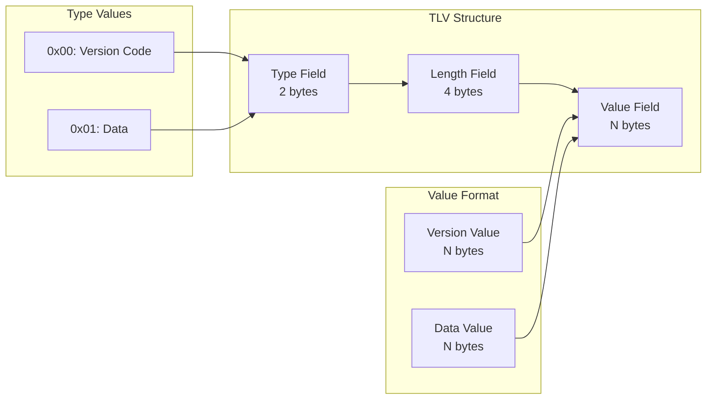

### TLV Format Specification

The TLV (Type-Length-Value) format is used for efficient storage and transmission of events. Each event is encoded as follows:

1. **Type Field (2 bytes)**
   - Identifies the block type
   - Values:
     - 0x00: Version Code block
     - 0x01: Data block

2. **Length Field (4 bytes)**
   - Specifies the total length of the Value field in bytes
   - Maximum value: 10MB (10 * 1024 * 1024 bytes)

3. **Value Field (N bytes)**
   - Contains the actual block data
   - For Version Code blocks: Serialized version number
   - For Data blocks: Serialized event data

The format allows for efficient parsing and processing while maintaining flexibility for different block types and sizes. Each file can contain multiple TLV blocks concatenated together.

### Data Uploading

#### General Overview

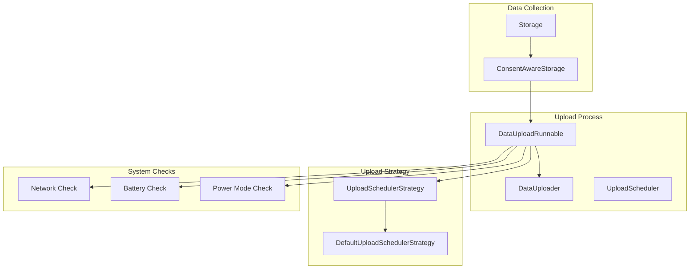

The data uploading process in the Datadog Android SDK follows a robust architecture that ensures reliable delivery of telemetry data while respecting system resources and user privacy. Here's how it works:

1. **Storage Layer**
   - Data is stored in batches using `ConsentAwareStorage`
   - Each feature has its own storage instance
   - Batches are managed through file-based persistence

2. **Upload Process**
   - `DataUploadRunnable` handles the upload process
   - Runs on a dedicated thread pool
   - Processes multiple batches per run (configurable)
   - Respects system conditions (network, battery, power mode)

3. **Upload Strategy**
   - Configurable through `UploadSchedulerStrategy`
   - Default implementation in `DefaultUploadSchedulerStrategy`
   - Controls timing between upload attempts
   - Handles backoff and retry logic

#### Consent-Aware Storage

The SDK implements a consent-aware storage system that manages data based on the current tracking consent status:

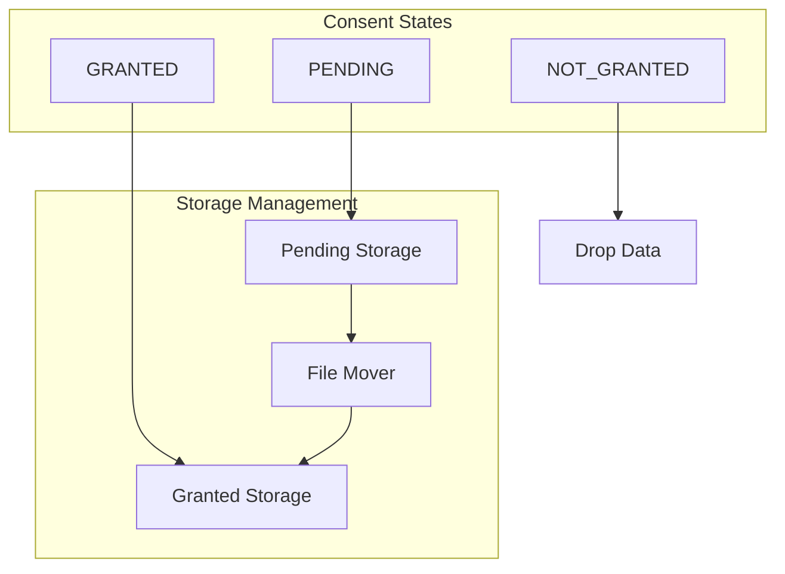

1. **Consent States**
   - `PENDING`: Data is stored in pending storage
   - `GRANTED`: Data is moved to granted storage and uploaded
   - `NOT_GRANTED`: Data is dropped

2. **Storage Management**
   - Separate orchestrators for pending and granted data
   - File mover handles transitions between states
   - Automatic cleanup of old data
   - Thread-safe operations

#### Retry Mechanism

The SDK implements a sophisticated retry mechanism to handle various failure scenarios:

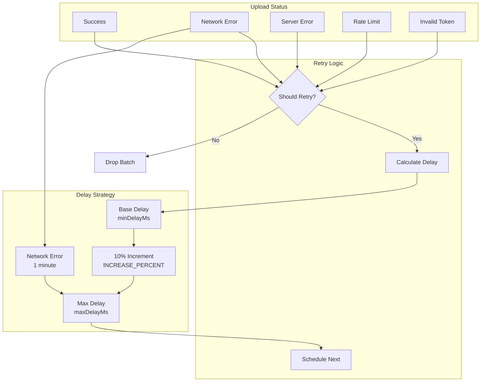

1. **Upload Status Handling**
   - Success (202): Batch is dropped, next batch processed
   - Network Error: Retry with exponential backoff
   - Server Error (5xx): Retry with exponential backoff
   - Rate Limit (429): Retry with exponential backoff
   - Invalid Token (401): Batch dropped, no retry
   - Other Client Errors (4xx): Batch dropped, no retry

2. **Delay Calculation**
   - Base delay is configured through `DataUploadConfiguration`:
     - `minDelayMs`: Base frequency (e.g., 1000ms)
     - `maxDelayMs`: Maximum allowed delay (10x base frequency)
     - `defaultDelayMs`: Initial delay (5x base frequency)
   - Delay increases by 10% on each retry (INCREASE_PERCENT = 1.10)
   - Special handling for network errors:
     - Network errors (IOException) trigger a fixed 1-minute delay
     - This prevents battery drain during network issues
   - Example progression:
     ```
     Base delay: 1000ms
     Attempt 1: 1000ms
     Attempt 2: 1100ms (1000 * 1.10)
     Attempt 3: 1210ms (1100 * 1.10)
     Network Error: 60000ms (1 minute)
     ```
   - The delay is capped at `maxDelayMs` to prevent excessive wait times
   - Successful uploads reset the delay to `minDelayMs`

3. **Retry Strategy**
   - Status-specific retry decisions
   - Automatic retry for transient failures
   - Immediate retry for rate limiting
   - No retry for permanent failures

### Telemetry System

The SDK implements a comprehensive telemetry system to monitor its own health, performance, and usage. This system helps track SDK behavior, diagnose issues, and gather usage statistics.

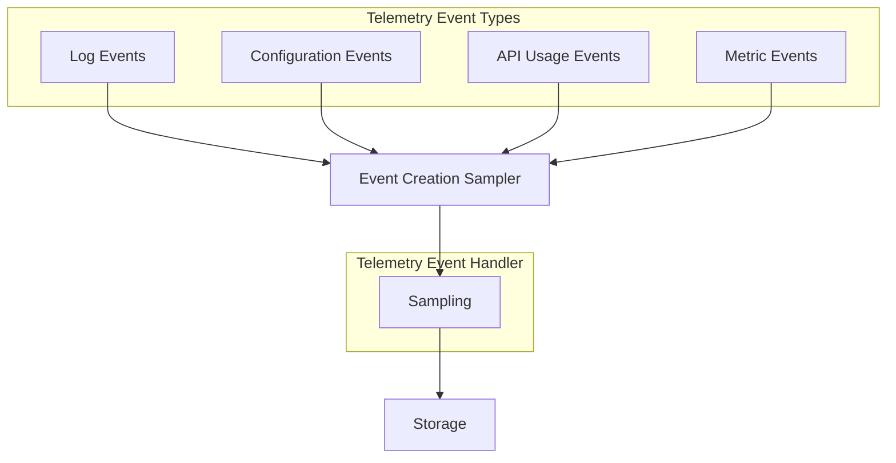

#### Event Types

1. **Log Events**
   - Debug logs for internal SDK operations
   - Error logs with stack traces and error kinds
   - Additional properties for context
   - Sampling rate control to prevent spam

2. **Configuration Events**
   - Track SDK configuration changes
   - Monitor feature flags
   - Record batch processing settings
   - Track encryption and proxy settings

3. **API Usage Events**
   - Monitor SDK API calls
   - Track feature usage patterns
   - Record view loading times
   - Default sampling rate of 15%

4. **Metric Events**
   - Performance measurements
   - Resource usage statistics
   - Custom metrics with properties
   - Configurable sampling rates

#### Event Processing

1. **Event Handling**
   - Events are processed by `TelemetryEventHandler`
   - Session-based event tracking
   - Maximum events per session limit
   - Duplicate event detection

2. **Sampling Strategy**
   - Multi-layered sampling strategy
   - Controlled data volume
   - Statistical significance
   - Resource efficiency
   - No duplicate events
   - Session-based limits

#### Sampling Strategy

The SDK implements a multi-layered sampling strategy that varies by event type. Each telemetry event goes through specific sampling layers to control data volume:

```mermaid
graph TB
    subgraph "Log Events"
        LogGlobal[Event creation Sampler]
        LogDuplicate[Duplicate Check]
        LogSession[Session Limit]
        LogEvents[Log Events]
        LogTelemetrySampler[Telemetry configuration Sampler]
    end

    subgraph "Configuration Events"
        ConfigGlobal[Event creation Sampler]
        ConfigExtra[Config Extra Sampler]
        ConfigSession[Session Limit]
        ConfigEvents[Config Events]
        ConfigTelemetrySampler[Telemetry configuration Sampler]
    end

    subgraph "API Usage Events"
        ApiGlobal[Event creation Sampler]
        ApiSession[Session Limit]
        ApiEvents[API Events]
        ApiTelemetrySampler[Telemetry configuration Sampler]
    end

    subgraph "Metric Events"
        MetricGlobal[Event creation Sampler]
        MetricSession[Session Limit]
        MetricEvents[Metric Events]
        MetricTelemetrySampler[Telemetry configuration Sampler]
    end

    subgraph "Performance Events"
        PerformanceGlobalCreation[Sampler At Creation]
        PerformanceGlobalEnding[Sampler At Ending]
        PerformanceSession[Session Limit]
        PerformanceEvents[Performance Events]
        PerformanceTelemetrySampler[Telemetry configuration Sampler]
    end

    LogGlobal --> LogEvents
    LogDuplicate --> LogEvents
    LogSession --> LogEvents
    LogTelemetrySampler --> LogEvents

    ConfigGlobal --> ConfigEvents
    ConfigExtra --> ConfigEvents
    ConfigSession --> ConfigEvents
    ConfigTelemetrySampler --> ConfigEvents

    ApiGlobal --> ApiEvents
    ApiSession --> ApiEvents
    ApiTelemetrySampler --> ApiEvents

    MetricGlobal --> MetricEvents
    MetricSession --> MetricEvents
    MetricTelemetrySampler --> MetricEvents

    PerformanceGlobalCreation --> PerformanceEvents
    PerformanceGlobalEnding --> PerformanceEvents
    PerformanceSession --> PerformanceEvents
    PerformanceTelemetrySampler --> PerformanceEvents
```

1. **Log Events**
   - **Creation Sampling**: Applied through `eventSampler`
   - **Duplicate Detection**: Prevents duplicate log events within a session
   - **Session Limit**: Maximum events per session check
   - **Telemetry configuration Sampler**: Applied through `telemetryConfigurationSampler`

2. **Configuration Events**
   - **Creation Sampling**: Applied through `eventSampler`
   - **Config Sampling**: Additional sampling through `configurationExtraSampler`
   - **Session Limit**: Maximum events per session check
   - **Telemetry configuration Sampler**: Applied through `telemetryConfigurationSampler`

3. **API Usage Events**
   - **Creation Sampling**: Applied through `eventSampler`
   - **Session Limit**: Maximum events per session check
   - **Telemetry configuration Sampler**: Applied through `telemetryConfigurationSampler`

4. **Metric Events**
   - **Creation Sampling**: Applied through `eventSampler`
   - **Session Limit**: Maximum events per session check
   - **Telemetry configuration Sampler**: Applied through `telemetryConfigurationSampler`

5. **Performance Events**
   - **Sampling at creation**: Applied through `eventSampler`
   - **Sampling at ending**: Applied through `eventSampler`
   - **Session Limit**: Maximum events per session check
   - **Telemetry configuration Sampler**: Applied through `telemetryConfigurationSampler`

**Common Controls**
- All events are subject to the global `telemetryConfigurationSampler`
- All events respect the session-based event limit
- Sampling decisions are deterministic
- Thread-safe sampling operations
- Rates range from 0-100%

The sampling strategy ensures efficient data collection while maintaining statistical significance for each event type.
