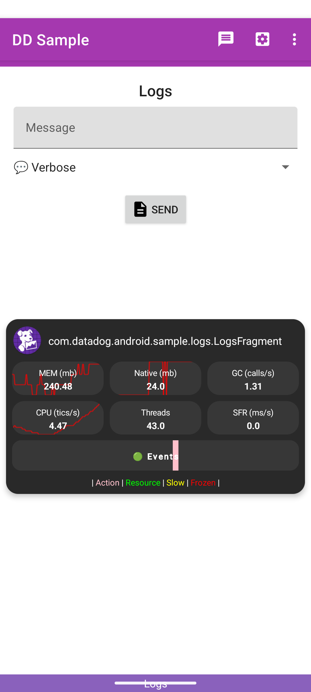

# Datadog RUM Debug Widget for Android

This feature module contains the Datadog RUM Debug Widget for Android, which can be integrated into your application to help visualize RUM data being collected in real-time.
It is intended for debugging and development purposes only and should not be included in production builds.

As shown in the screenshot below, the widget provides a floating overlay that displays key metrics such as memory usage, CPU load and RUM events.

