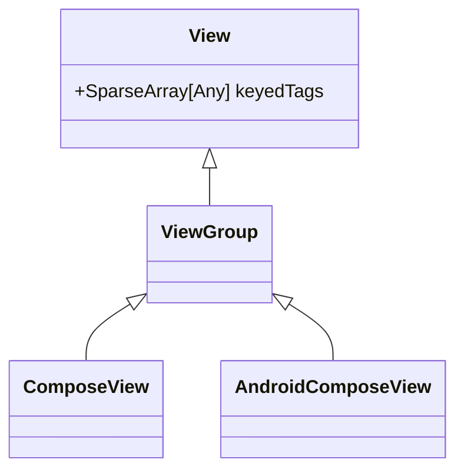
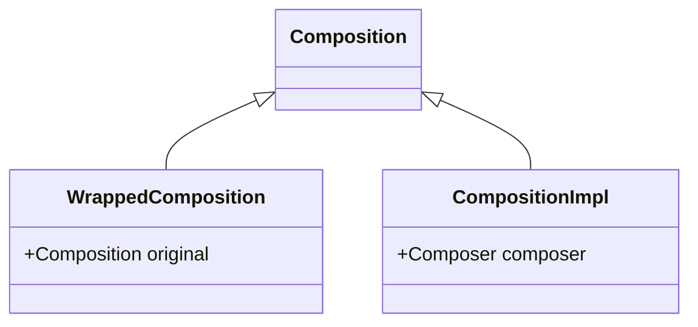
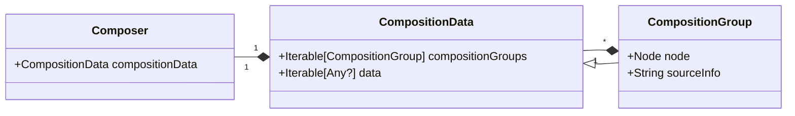

## ComposeView & AndroidComposeView

The `ComposeView` or one of its children (typically an `AndroidComposeView`) will contain a `Composition` object 
in it's internal tags with the key `androidx.compose.ui.R.id.wrapped_composition_tag`. 

It will be an instance of the `WrappedComposition` class which in turns holds a `CompositionImpl` instance, 
from which we get a `Composer` instance.  

## Composer 

Quoting from the KDoc: 

- `CompositionData` is the data tracked by the composer during composition.
- `CompositionGroup` is a group of data slots tracked independently by composition (e.g. one branch of an if-else). It contains: 
    - A `sourceInfo` String giving insights about the source code (file, line number, …) which generated this group
    - An `identity` key identifying a group through recompositions
    - An optional `node` representing an actual Node 
    - The `data` corresponds to the composable inputs and parameters. Some known types of data are: 
        - `CompositionContextHolder`: an entity holding a set of `Composer` objects, corresponding to sub-composed groups.
        - …

## Source Info

The Source Info param is a string generated at compile time, 
providing several pieces of information about the compose group. 

Based on the UI Tooling library, it contains a list of tokens formatted as follows: 

- `C` an inlined call to a composable function
- `C(name)` a call to a composable function
- `P(parameters)` the parameters information, as a comma separated list of params formatted as follows: 
    - `\d+` : the index ot the param as a number
    - `\d+:inline-class`: the index ot the param as a number, followed by the inline class (which contains anything but `,` or `!`)
    - `!\d+`: a run number (refers to the first n parameters of the call)
- `\d+@\d+L\d+`: a source location info, with three numbers : 
    - A 0 offset line number of the source location.
    - Offset into the file. The offset is calculated as the number of UTF-16 code units from the beginning of the file to the first UTF-16 code unit of the call that produced the group.
    - The length of the source code. The length is calculated as the number of UTF-16 code units that that make up the call expression.
- `*`: indicate a repeat point in the list of source location info available in this source info
- `:source_file.kt#hash`: indicates the name of the file with the code for this compose group. The hash that follows the `#` sign represents a hash code of the package name of the file. This can be used to disambiguate which file is referenced by `source_file.kt`.

## RecomposeScopeImpl

Some CompositionGroup will hold in their `data` Iterable an instance of `RecomposeScopeImpl`, which will hold a 
`block` lambda. That block lambda is used to actually perform the composition job, and is only called
when an update is needed. 

This lambda is essentially a Single Abstract Method interface, which implementations hold the parameter to 
the `@Composable` methods (e.g. it'll hold the `text` String param to the `Text()` function).

Each parameter becomes a property of the Composable class, generated by the Compose compiler. 
We can then read each field automatically to get access to the value passed as parameters. 

